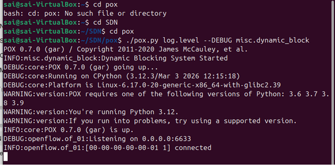
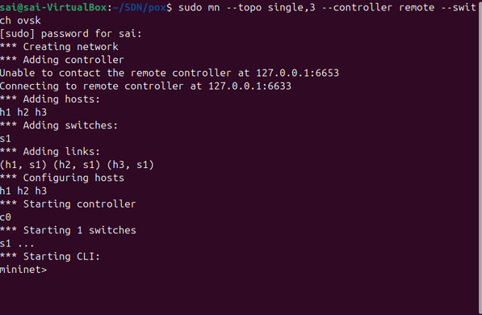
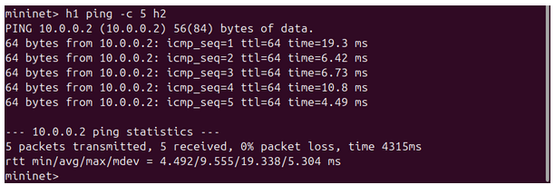
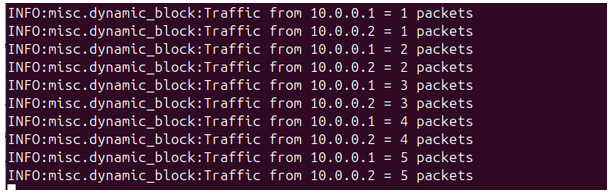
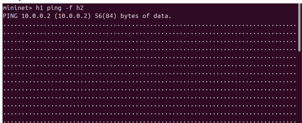
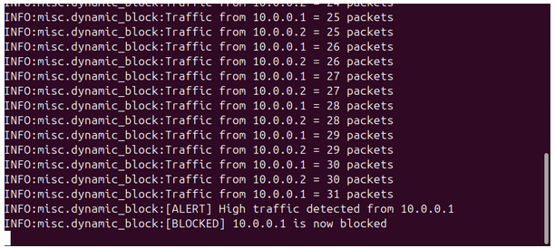
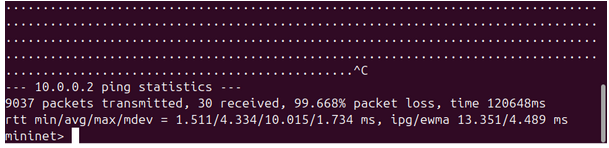
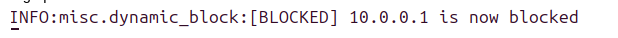
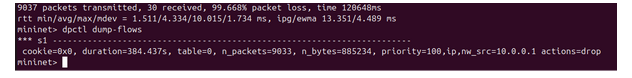

# Dynamic Host Blocking System using POX (SDN)

## 📌 Overview

This project implements a **Dynamic Host Blocking System** using Software Defined Networking (SDN) with the POX controller.
It detects abnormal traffic and dynamically blocks malicious hosts by installing flow rules in the switch.

---

## 🎯 Objectives

* Monitor host traffic
* Detect high traffic behavior
* Block malicious hosts dynamically
* Verify blocking using flow rules

---

## 🛠 Requirements

* Ubuntu/Linux
* Mininet
* Open vSwitch
* POX Controller

---

## 🚀 Execution

### Start Controller

```bash
cd ~/pox
./pox.py log.level --DEBUG misc.dynamic_block
```

### Start Mininet

```bash
sudo mn --topo single,3 --controller remote --switch ovsk
```

---

## 🧪 Experiment Output

### 🔹 Step 1: Controller + Mininet Start


*Figure 1: POX controller started and Mininet topology initialized*

---

### 🔹 Step 2: Normal Traffic


*Figure 2: Successful ping between hosts (no packet loss)*

---

### 🔹 Step 3: Traffic Monitoring


*Figure 3: Controller logs showing packet count per host*

---

### 🔹 Step 4: Heavy Traffic (Attack Simulation)


*Figure 4: High traffic generated using ping flood*

---

### 🔹 Step 5: Attack Detection


*Figure 5: Controller detects abnormal traffic*

---

### 🔹 Step 6: Blocking Action


*Figure 6: Host is blocked after exceeding threshold*

---

### 🔹 Step 7: High Packet Loss


*Figure 7: Packet loss observed after blocking*

---

### 🔹 Step 8: Flow Table Verification


*Figure 8: DROP rule installed in switch flow table*

---

### 🔹 Step 9: Controller Shutdown


*Figure 9: POX controller terminated*

---

## ⚙️ Working Principle

1. Switch sends packets to controller
2. Controller monitors traffic per host
3. If threshold exceeded:

   * Host is marked malicious
   * DROP rule is installed
4. Traffic from that host is blocked

---

## 🔧 Configuration

* `THRESHOLD` → Maximum allowed packets
* `TIME_WINDOW` → Time interval

---

## 🧹 Useful Commands

```bash
sudo mn -c              # Clear Mininet
sudo pkill -f pox       # Kill controller
sudo fuser -k 6633/tcp  # Free port
dpctl dump-flows        # View flow table
```

---

## ⚠️ Notes

* Start POX before Mininet
* Ensure port 6633 is free
* ARP packets must be forwarded

---

## 🎯 Conclusion

This project demonstrates how SDN enables **centralized control and dynamic security enforcement** by detecting and blocking malicious hosts in real-time.

---

## 👨‍💻 Author

Sai

